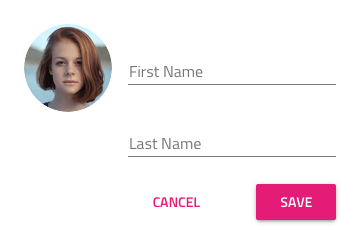
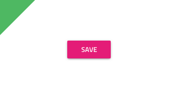
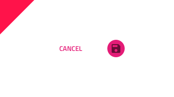

## Button

Use the Button Component Symbol to represent the trigger for a simple action that user can take. Buttons are used in cards, dialogs and forms and many other components and patterns.
The Button is visually identical to the [Ignite UI for Angular Button Component](https://www.infragistics.com/products/ignite-ui-angular/angular/components/button.html)

### Button Demo

### Type

Four types of Buttons are supported:

- A more prominent Raised Button with color fill and shadow that emphasizes an action and supports both **text** and combination of icon and text
- A less prominent Flat Button that is typically used for less important actions and supports both **text** and combination of icon and text
- An Icon Button for actions that are represented only with an Icon
- A very prominent Floating Action Button (fab) with color fill and shadow that is used once per screen to strongly emphasize the main action

### States

Every type of button supports a **default**, hover and disabled state. A button with icon and label is also available in the default state.

### Styling

The Buttons come with styling flexibility through the various overrides controling the background, label and icon colors.

## Usage

When the content of a Button contains a label, it must be uppercase and with a thicker (usually Medium or Semibold) font treatment. When more than one Button is needed for a layout, size them with equal height and arrange them on the same horizontal plane next to each other with sufficient space on both sides to avoid erroneous taps and clicks. In such layouts avoid combining the different types of buttons, preferably choose one and use it consistently for all actions that belong in that section of the UI.

| Do                            | Don't                           |
| ----------------------------- | ------------------------------- |
|  |  |
|  |  |
|  |  |

## Code generation - TODO

> [!WARNING]
> Triggering `Detach from Symbol` on an instance of the Button in your design is very likely to result in loss of code generation capability for the Button.

`🕹️DataSource`
`🕹️Event`

## Additional Resources

Related topics:

- [Button Group](button-group.md)
- [Card](card.md)
- [Dialog](dialog.md)
- [Snackbar](snackbar.md)
- [Time Picker](time-picker.md)
- [AV Player Pattern](av-player.md)
- [File Upload Pattern](file-upload.md)
- [Form Pattern](forms.md)
  

Our community is active and always welcoming to new ideas.

- [Indigo Design **GitHub**](https://github.com/IgniteUI/design-system-docfx)
