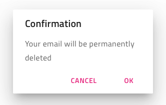

## Dialog

Use the Dialog Component to show a message or alert to the user, allowing him to take action accordingly or to present a form that requires immediate action before proceeding, such as a login. The Dialog is displayed modally, meaning that the user has to complete or close it before moving on. The Dialog is visually identical to the [Ignite UI for Angular Dialog Window Component](https://www.infragistics.com/products/ignite-ui-angular/angular/components/dialog.html)

### Dialog Demo


### Types

The Dialog can be used to show an alert with only a confirming button, a message with cancellation and confirmation, or as a container for action that needs immediate attention, such as a user logging into his account.





### Styling

The Dialog comes with styling flexibility through the various overrides for its title and message, as well as the buttons at the bottom that individually styled as flat or raised with all the styling options that these two [Button](button.md) types provide.


## Usage

When designing a custom content Dialog, avoid placing buttons in the content section and use the existing dialog buttons for your actions instead.

| Do                            | Don't                           |
| ----------------------------- | ------------------------------- |
|  |  |

## Code Generation

When colors or fonts are specified for the Dialog, the Dialog HTML element will be wrapped in a div. This is required by browsers to style a nested component (a component within another component). Currently changing of the button background color, button text style isn’t supported.

> [!WARNING]
> Triggering `Detach from Symbol` on an instance of the Dialog in your design is very likely to result in loss of code generation capability for the Dialog.

### Data Bindings

Data bindings are specified by using curly brace syntax, example: {isAdmin}. Text fields (not `🕹️DataProperty` or `🕹️DataSource`) also support string interpolation syntax example: Admin: {isAdmin}. Data bindings can be non-nested or nested. If the target property is a nested property, include the nested property chain, but don’t include the model object name. Examples:

#### Not Nested

```PseudoCode
Customer {
  imageName: String;
}

DataProperty would be: {imageName}
```

#### Nested

```PseudoCode
Profile {
  imageName: String;
}

Customer {
  profile: Profile;
}

DataProperty would be: {profile.imageName}
```

### Text

There are four Text properties for the Dialog, Title, Message, Left Button, and Right Button. These properties may contain text, binding, or a combination of the two, examples:

- Settings
- {settingsLabel}
- Important {labelText}

### Buttons

There are Left and Right buttons. Each Button has a Type field that can be set Flat or Raised. Currently Text Style and Background on the Buttons are ignored.

### Event

There is no event property for this control for the user to set. Instead, the onLeftButtonSelect and onRightButtonSelect events are automatically outputted when the corresponding button is rendered.

## Additional Resources

Related topics:

  <div class="divider--half"></div>

Our community is active and always welcoming to new ideas.

- [Indigo Design **GitHub**](https://github.com/IgniteUI/design-system-docfx)
