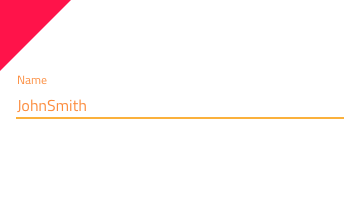

## Input

Use the Input Component to collect user data such as strings and numbers fitting various contexts, dates, and other values. Multiple inputs can be combined to craft easy-to-use and aesthetic forms. The Input is visually identical to the [Ignite UI for Angular Input Group Component](https://www.infragistics.com/products/ignite-ui-angular/angular/components/input_group.html)

### Input Demo


### Types

The Input comes with or without a helper text and provides choice between four distinct types, e.g. line style for a more airy style or border style for a more structured perception on solid color backgrounds. The boxed style is most appropriate when the Input is placed on top of an vivid image to improve readability of its content.


`line`

`box`

`border`

`search`

### Variants

The Input can be used styled in **dark** and light variants to assure good readability and contrast for both lighter and darker backgrounds.


### State

When the user interacts with the Input, it goes through various states: **idle** with a placeholder in the place of the content, focused while the user is typing in it, filled once the user has finished adding content and moved on, and disabled when the input does not support any interaction. These flexibility enhancements afford a more dynamic interaction design that can seamlessly flow into high-fidelity prototyping.


`focused`

`filled`

`disabled`

Every experienced designer uses constraints wisely to limit the user input and avoid invalid states, hence the availability of validation styles. Through the available validation styles, the Input is equipped for sophisticated designs that display success, warning, and error visuals.


### Layout

The Input has rich support for prefix and suffix through text string or icon that can, in certain cases, reduce the input effort for the user: e.g. an @email.com suffix means both less keystrokes and more clarity of expected content, while a clock or calendar prefix may indicate that the Input is suitable to provide time or date as content.


> [!INFO]
> ↳ Layout
>
> - .../OnlyText/...
> - .../Prefix + Suffix/Icons/...
> - .../Prefix + Suffix/String/...
> - .../Suffix/Icons/...
> - .../Suffix/String/...

### Calendar and Time Picker Inputs

These two are special types of Input customized for the purposes of date and time selection. They have a consistent structure with the other Inputs, but the layout, which is fixed in a certain way for each state. The icons that appear at the prefix location are set to the Material Icons `calendar-today` and `access-time` and can not be changed via the overrides panel.


### Styling

The Input comes with styling achievable through changing the primary, success, warning, and error colors of your theme in the Styling library.


## Usage

Use the box type of Input when placing forms on top of an image to improve readability. When using an Input in warning or error state in your designs, prefer the one with helper text and use the opportunity to provide guidance to the user.

| Do                           | Don't                          |
| ---------------------------- | ------------------------------ |
|  |  |
|  |  |

## Code generation

When colors or fonts are specified for the Input Group, the Input Group HTML element will be wrapped in a div. This is required by browsers to style a nested component (a component within another component).

> [!WARNING]
> Triggering `Detach from Symbol` on an instance of the Input in your design is very likely to result in loss of code generation capability for the Input.

Data binding are specified by using curly brace syntax, example: {isAdmin}. Text fields (not `🕹️DataProperty` or `🕹️DataSource`) also support string interpolation syntax, example: Admin: {isAdmin}. Data bindings can be non-nested or nested. If the target property is as nested property, include the nested property chain, but don’t include the model object name. Examples:

#### Not Nested

```PseudoCode
Customer {
  imageName: String;
}

DataProperty would be: {imageName}
```

#### Nested

```PseudoCode
Profile {
  imageName: String;
}

Customer {
  profile: Profile;
}

DataProperty would be: {profile.imageName}
```

### Event Property

When supplied the `🕹️Event` property is used to create a method in the component TypeScript and add an Angular click signature in the HTML. Except for the Time Picker and Date/Calendar where it is the onValueChanged or onSelection instead. Searchbar does not support this. When supplied the event must be specified using the curly braces format: {onEventName} .

### DataProperty

When supplied, the `🕹️DataProperty` value is used to set up two-way data binding to the Input Group formControlName property. The `🕹️DataProperty` is optional. When provided, it will be the name of the property on the data object specified by the model object name provided in the generation request.

### Input

Determines the type of styling applied to the Input Group. When set to None, no control will be rendered. The Time Picker and Date/Calendar do not support this. Box, Border, Line, and Searchbar do not have this property as their base type are the values of this field.

### Variant

Determines if the theme is light or dark. The Time Picker and Date/Calendar do not support this. If set to None, the control will not be rendered.

### State

If set to None, the control will not be rendered.

### Layout

Determines the layout of the Input Group. When set to display Prefix and/or Suffix, text or icons can be displayed at the corresponding ends of the input. The Searchbar instead has a Left and Right Icons that can be turned on/off individually and does not support text in the Prefix/Suffix. The Time Picker and Date/Calendar do not support this. When set no None, the control will not be rendered.

### Label

Determines the text to be displayed in the Label

### Input Text

Determines the text to display in the Input value. If the `🕹️DataProperty` is set, this is ignored.

### Help Text

Determines the text to be displayed in the Hint of the Input Group. The Time Picker and Date/Calendar do not support this.

### Search Hint

Determines the text to display in the label of the Searchbar (only supported in Searchbar).

## Additional Resources

Related topics:

- [Form Pattern](forms.md)
- [User Profile Pattern](userProfile.md)
  <div class="divider--half"></div>

Our community is active and always welcoming to new ideas.

- [Indigo Design **GitHub**](https://github.com/IgniteUI/design-system-docfx)
