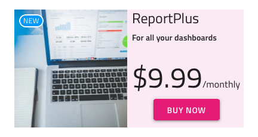
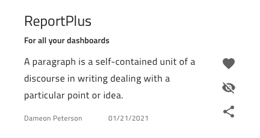
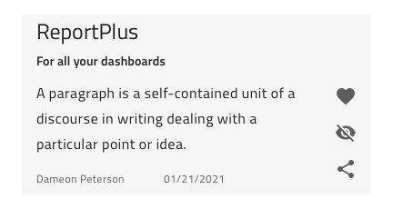
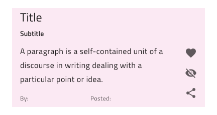
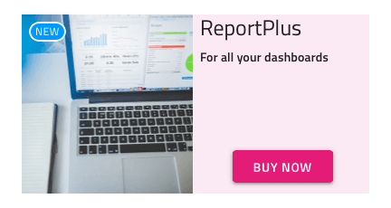
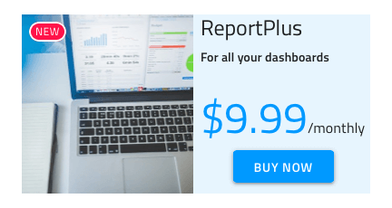

## Custom List Item

Use the Custom List Item Component to display the same type of information that you would in a normal List Item but with the complete freedom to arrange your layout exactly as you would like. The Custom List Item is achievable by writing the necessary customizations to the layout of the items of the [Ignite UI for Angular List Component](https://www.infragistics.com/products/ignite-ui-angular/angular/components/list.html)

### Custom List Item Demo

### State

The Custom List Item supports the following interactive states: inactive for the normal state and active for the selected state.

### Detach from Symbol

In order to customize List Item layouts, start by dragging a `List/Items/Custom` to your artboard, right clicking on top of it, and selecting the `Detach from Symbol` option near the bottom of the contextual menu. In your layers panel under the newly appeared _List/Items/Custom/~_ group, you should see the following:

> [!INFO]
> | Layer | Use |
> | ----------------------------- | ---------------------------------------- |
> | 🚫 igx-list-item/custom:~ | A special locked layer starting with a prohibited icon. This layer is required by the code generation and you should avoid deleting or modifying it. |
> | 💡Primary Action Group | Groups together the Primary Action layout elements |
> | 💡Secondary Action Group | Groups together the Secondary Action layout elements |
> | 🌈 Background | Defines the background color of the List Item |

#### Styling

The Custom List Item has high-level styling flexibility similar to the normal List Item with a few overrides for the Secondary Actions and control over their text, icons, and buttons colors. Just like every List Item, it is possible to specify the Item background color through the overrides, as well.

#### Layout

So, let's see how we can create the intricate layout for the product List Item above in three simple steps. Once we have dragged in an inactive Custom List Item in an empty Artboard, selected the `Detach from Symbol` and applied the basic styling available changing the background color, we should have something like this for a starting point.

1.  We will reuse the Header from the Primary Action Group but resize it to fit in the right half only and update the strings for the Title and Subtitle Text. In the Secondary Action Group, we will add a Raised Button position to it near the bottom right corner, updating its text and resizing accordingly to fit the new value. Lastly, let's remove the default Secondary Action, as we will not be needing Icons for our target custom layout.

2.  Next, we will insert a List/Items/Blocks/Content/Image in the Primary Action Group and add a Badge on top of it within the same group. Now, we have to size the image according to the Item size and select content for it. After modifying the Badge, as well by updating its Value Text and hiding its Border and Elevation, we should have something similar to this.

3.  In the last step, we will add a couple of Text/Title elements to the Primary Action Group: a larger H3 to display the price of the product and a smaller H6 to its right for complimentary text. After positioning them in the empty space between the Header and the Raised Button, we can make a final alignment adjustment to the Raised Button with which our target layout is complete.

#### Additional Styling

With this List Item layout, a lot of additional styling is possible based on the elements that have been inserted in it. For example, we can set a color for the text of the pricing to emphasize it and change the Badge background and Raised Button background colors.

## Additional Resources

Related topics:

- [Badge](badge.md)
- [Button](button.md)
- [Text](text.md)
- [Lists Pattern](lists.md)
  

Our community is active and always welcoming to new ideas.

- [Indigo Design **GitHub**](https://github.com/IgniteUI/design-system-docfx)
