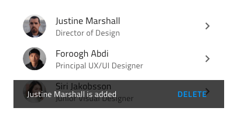
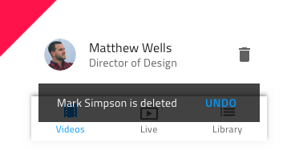
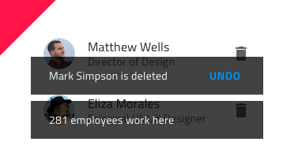

## Snackbar

Use the Snackbar Component Symbol to show a short notification or provide indication for the most recent action such as adding or deleting a record in a listing, with the option to trigger a simple extra action such as undo.
The Snackbar is visually identical to the [Ignite UI for Angular Snackbar Component](https://www.infragistics.com/products/ignite-ui-angular/angular/components/snackbar.html)

### Snackbar Demo


### Styling

The Snackbar comes with constrained styling flexibility allowing only to change the text color of its action button.



## Usage

The Snackbar always appears on top of other content, so avoid placing on top of the main application navigation. Pick an emphasizing style for its action button that contrasts it with the message and avoid stacking multiple Snackbars in a column - show only the most recent one instead.

| Do                              | Don't                             |
| ------------------------------- | --------------------------------- |
|  |  |
|  |  |
|  |  |

## Code generation

When colors or fonts are specified for the Snackbar, the Snackbar HTML element will be wrapped in a div. This is required by browsers to style a nested component (a component within another component).

> [!WARNING]
> Triggering `Detach from Symbol` on an instance of the Snackbar in your design is very likely to result in loss of code generation capability for the Snackbar.

### Text Binding

There are Text properties for the Message and Button. When supplied they can be bound to a nested or non-nested data item.
If the property is a nested property, include the nested property chain, but don’t include the model object name. Examples:

#### Example Not Nested

```typescript
Customer {
messageText: string;
}
Text would be: { messageText }
```

#### Example Nested

```typescript
Profile {
messageText: number;
}
Customer {
profile: Profile;
}
Text would be: {profile. messageText }
```

### Event

When supplied the `🕹️Event` property is used to create a method in the component TypeScript and add an onAction signature in the HTML of the Snackbar.

## Additional Resources

Related topics:

Our community is active and always welcoming to new ideas.

- [Indigo Design **GitHub**](https://github.com/IgniteUI/design-system-docfx)
