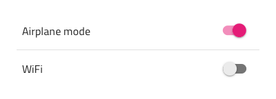
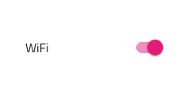
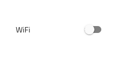

## Switch

Use the Switch Component Symbol to allow the user make a selection, which most often expresses turning on/off a configuration in a list of settings.
The Switch is visually identical to the [Ignite UI for Angular Switch Component](https://www.infragistics.com/products/ignite-ui-angular/angular/components/switch.html)

### Switch Demo

### Theme

The Switch can be used styled in **dark** and light variants to assure good readability and contrast for both lighter and darker backgrounds.

### Label use

The Switch can be used **with** or without label. In order to hide the label set its text value to a blank/space character and reduce the width of the component to e.g. 38px.

### State

The Checkbox provides **on** and off selection states with additional variants for a disabled interaction state.

### Styling

The Switch comes with styling flexibility allowing control over the thumb and track colors. There is a fixed alpha value applied to the track to make it semi transparent.

## Usage

The Switch should appear to the right of the label describing the option, whose state it controls, in a list of settings. Avoid placing it near the left edge of the screen, and if that is absolutely necessary for a reason, please use a Checkbox instead. Also use the same or very similar colors for the Switch thumb and track.

| Do                            | Don't                           |
| ----------------------------- | ------------------------------- |
|  |  |
|  |  |
|  |  |

## Code generation

> [!WARNING]
> Triggering `Detach from Symbol` on an instance of the Navigation Drawer will reduce the accuracy of code generation for the Navigation Drawer. Do this only if you need to create more items than provided and make sure you keep the `🚫igx-nav-drawer` and `🕹️DataSource` layers intact.

The Navigation Drawer symbol has a special `🕹️DataSource` field in its `Overrides` section. Use the curly braces notation _{notifications.count}_ to provide a reference for code generation to the database property, which should be used as a binding.

## Additional Resources

Related topics:

* [Lists](lists.md)
  

Our community is active and always welcoming to new ideas.

* [Design System **Forums**](https://www.infragistics.com/community/forums/f/ignite-ui-for-angular)
* [Design System **GitHub**](https://github.com/IgniteUI/igniteui-angular)
