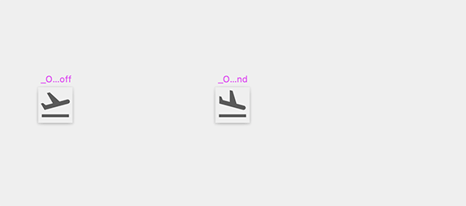
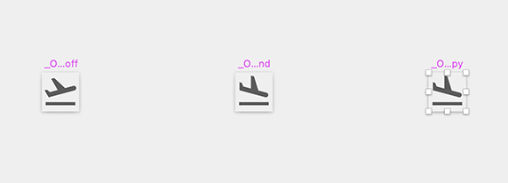
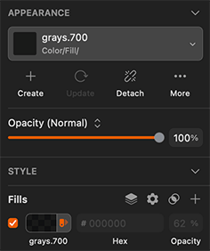

---
title: マテリアル アイコン - デザイン システム スタイリング
_description: スタイリングのマテリアル アイコン シンボルはマテリアル デザインの全般的な操作を示すシンボルのコピーです。
_keywords: デザイン システム, Sketch, Ignite UI for Angular, UI ライブラリ, アイコン, マテリアル
_language: ja
---

## マテリアル アイコン

Icon Buttons、List Items、Cards などで全般的な操作を記号として表示するためにマテリアル アイコンを使用します。たとえば、Button ラベルでテキストの代わりにアイコンを使用します。マテリアル アイコンはスタイリングのカラー シンボルを使用します。デザインするアイコンのために定義済みの色を選択できます。スタイリング ライブラリに追加されるアイコンのセットは[マテリアル アイコン](https://material.io/tools/icons/?style=baseline)と同じ要素のサブセットで、[Ignite UI for Angular](https://jp.infragistics.com/products/ignite-ui-angular) にサポートされます。

> [!Note]
> コンポーネント ライブラリは 4 つのアイコン サイズ (ExtraLarge、Large、Medium、および Small) で [Icon](icon.md) シンボルを提供します。記事、カスタム Card および List Item の高度なレイアウトを作成で直接スタイリング ライブラリを使用する代わりにこのアイコンを使用します。

### マテリアル アイコン

スタイリング ライブラリに 100+ マテリアル アイコンのセットが利用可能で、マテリアル デザインのカテゴリでグループ化されます。

- file
- communication
- action
- alert
- av
- content
- device
- image
- maps
- navigation
- notifications
- social
- toggle
- editor
- wb
- hardware

### マテリアル アイコンの追加

アイコンの定義済みコレクションを使用してコンポーネントおよびパターンにアイコンを分かりやすいシンボルとして追加できます。その他のアイコン セットの追加が可能ですが、現在のセットにその他のマテリアル アイコンを追加することもできます。[Ignite UI for Angular](https://jp.infragistics.com/products/ignite-ui-angular) でマテリアル アイコンがサポートされるため、アイコンを既存のセットに追加できます。次の簡単な手順に従います。

1.  ブラウザーで[マテリアル デザイン アイコン ツール](https://material.io/tools/icons)に移動します。「`copyright`」などに使用するアイコンを検索し、SVG としてダウンロードして「`Action`」などのカテゴリを確認します。Sketch でスタイリング ライブラリを開き、左側にそのカテゴリがテキスト レイヤーとして存在するかどうかを確認します。存在しない場合は作成して、以下の手順を行います。「`Action`」カテゴリの `copyright` アイコンの例のように存在する場合、そのカテゴリの最も右側にあるアイコンを検索します。

2.  このアイコンのシンボルをコピーして右へ移動します。名前が「`...Copy`」と終了し、構造がシンボルのグループで以下のようになります。

| レイヤー                | 使用                         |
| ----------------------- | ---------------------------- |
| Icon 24px               | アイコン要素をグループ化     |
| &nbsp;&nbsp; ↳ 🌈 Color | アイコンの色を定義           |
| &nbsp;&nbsp; Shape      | アイコンの図形を定義         |
| &nbsp;&nbsp; Shape      | 境界ボックスを定義する長方形 |

3.  既存のアイコン図形をダウンロードした SVG と置き換えます。アイコン図形の Shape レイヤーを選択し、`copyright` アイコンの SVG をその上にドラッグ アンド ドロップします。これはアイコン名の新しいグループをレイヤー パネルに作成します。このグループを展開し、アイコン図形をグループ以外で元のアイコン図形の上にドラッグします。

4.  新しいアイコン図形を移動した後、元のアイコン図形およびグループを削除します。`copyright` 記号のアイコン図形を選択し、境界線および塗りつぶしを削除して、マスクのみとして使用されることを確認します。グループを `copyright` に名前変更し、シンボルを `icons/action/copyright` に名前変更した後、このアイコンを使用できます。

## その他のリソース

関連トピック:

- [Icon](icon.md) コンポーネント
  

コミュニティに参加して新しいアイデアをご提案ください。

- [Indigo Design **GitHub** (英語)](https://github.com/IgniteUI/design-system-docfx)
